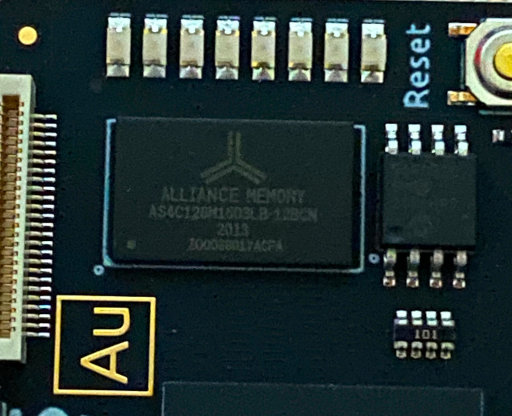
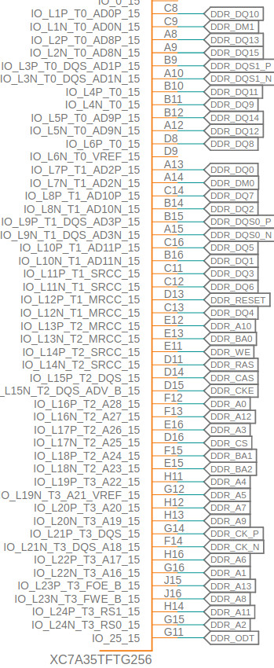

# BasicDDR

DDR 인터페이스를 설정하는 예제입니다.

## 대상
### 소프트웨어

* Xilinx Vivado 2023.1

### 하드웨어

* Alchitry Au Board : Xilinx Artix 7 FPGA

## 부품

* FPGA: xc7a35tftg256-1
* RAM: AS4C128M16D3LB-12BCN

## 스펙

* RAM (AS4C128M16D3LB-12BCN)
  - 데이터시트와 AU 보드 회로도 상
    + 데이터시트 상 DDR3L-1600 CL11 : 1.25 ns cycle time (800 MHz)
    + 회로도 상 1.35V 로 연결됨

* FPGA (xc7a35tftg256-1)
  - DS181 상에서 speed grade -1 인 경우
    + DDR3L 4:1 Memory Controller: 최대 667 Mbps
    + DDR3L 2:1 Memory Controller: 최대 620 Mbps

## 프로젝트 생성과 빌드

1. Vivado에서 새 RTL 프로젝트 생성

프로젝트 생성 시 part를 `xc7a35tftg256-1` 로 선택합니다.

2. Memory Interface Generator IP 추가

우선 clock 조합을 선택해야 합니다. 간단한 설정을 위해서 3077 / 5000 조합을 추천합니다.

추가 MMCM을 통해서 sys_clk과 clk_ref를 입력해야 하는데 clk_ref를 system clock을 reference clock으로 사용하는 경우 clk_ref 입력을 생략할 수 있습니다. 이것은 sys_clk을 200 MHz을 선택하는 경우에만 system clock을 reference clock으로 사용할 수 있습니다.

4:1 비율의 경우, FPGA 스펙 상 667 Mbps 이하로 조정해야 합니다. `1 / (666.66666 * 10**6 / 2) * 10**12 = 3000.0 ps` 이므로 최소값은 3000.0 ps (333.333 MHz) 이 됩니다.

2:1 비율의 경우, FPGA 스펙 상 620 Mbps 이하로 조정해야 합니다. `1 / (620 * 10**6 / 2) * 10**12 = 3225.8 ps` 이므로 최소값은 3225.8 ps (310.0 MHz) 이 됩니다.

| Clock Period | PHY to Contoller Clock Ratio | Input Clock Period | 추가 MMCM 출력 | 합성 여부 | 동작 여부 | 참고 |
| --- | --- | --- | --- | --- | --- | --- |
| 3000 ps (333.333 MHz) | 4:1 | 6000 ps (166.6667 MHz) | 166.66667 MHz / 200 MHz | OK | OK | |
| 3000 ps (333.333 MHz) | 4:1 | 9000 ps (111.1111 MHz) | 111.11111 MHz / 200 MHz | OK | OK | |
| 3226 ps (309.981 MHz) | 2:1 | 6452 ps (154.991 MHz) | 155.00000 MHz / 201.5 MHz | OK | OK | APP_DATA_WIDTH, MASK_WIDTH 이 변경됨 |
| 3077 ps (324.992 MHz) | 4:1 | 6154 ps (162.496 MHz) | 162.50000 MHz / 198.04688 MHz | OK | OK | |
| 3077 ps (324.992 MHz) | 4:1 | 5000 ps (200.000 MHz) | 200 MHz | OK | OK | system clock 을 reference clock 으로 사용 |

프로젝트 상의 `IP Catalog` 을 선택하고, `Memory Interface Generator` 을 검색하여 엽니다.

각 step에 대하여 다음 설정을 참고하여 수행합니다.

* Initial
  - Create Design
  - Component Name: **mig_7series_0**
  - Number of controllers: 1
  - AXI4 Interface: none

* Pin Compatible FPGAS
  - xc7a35ti-ftg256

* Memory Selection
  - DDR3 SDRAM

* Controller Options
  - Clock Period: 3077 ps
    - 위의 clock 조합을 참고합니다.
  - PHY to Controller Clock Ratio: 4:1
  - Memory Type: Components
  - `Create Custom Part` 선택
    - Select base part: MT41K128M16XX-15E
    - Enter new memory part name: AS4C128M16D3LB-12BCN
    - tcke: 5 ns
    - tfaw: **40 ns**
    - tras: 35 ns
    - trcd: 13.75 ns
    - trefi: 7.8 us
    - trfc: **160 ns**
    - trp: 13.75 ns
    - trrd: 6 ns
    - trtp: 7.5 ns
    - twtr: 7.5 ns
    - Row address: 14
    - Column address: 10
    - Bank address: 3
  - Memory Voltage: **1.35V**
  - Data Width: **16**
  - ECC: Disabled
  - Data Mask: on
  - Number of Bank Machines: 4
  - Ordering: **Normal**

타이밍 파라미터의 경우 해당 RAM 데이터시트에서 확인할 수 있습니다.

* Memory Options
  - Input Clock Period: 5000 ps (200 MHz)
  - Read Burst Type and Length: Sequential
  - Output Driver Impedance Control: RZQ/7
  - RTT: RZQ/4
  - Controller Chip Select Pin: Enable
  - Memory Address Mapping Selection: Bank/Row/Column

* FPGA Options
  - System Clock: No Buffer
  - Reference Clock: Use System Clock
    - 이 옵션은 input clock period가 200 MHz인 경우에만 선택할수 있습니다.
    - 이외의 clock 조합을 선택한 경우 'No Buffer'를 선택합니다.
  - System Reset Polarity: **ACTIVE HIGH**
  - Debug Signals for Memory Controller: OFF
  - Sample Data Depth: 1024
  - Internal Vref: **ON**
  - IO Power Reduction: ON
  - XADC Instantiation: Enabled

* EXtended FPGA Options
  - Internal Termination Impedance: 50 Ohms

* IO Planning Options
  - Fixed Pin Out

* Pin Selection
  - `Read XDC/UCF` 을 선택하고 `constraint/ddr.ucf` 파일을 불러옵니다.
    - 아니면 회로도를 참고하여 직접 선택할 수도 있습니다.
    - pin을 직접 선택하는 경우 회로도 상의 이름이 약간 이상할 수 있으므로 FPGA 쪽과 RAM 쪽을 모두 확인해야 합니다. 예를 들어 회로도 상의 DDR_CS의 경우 RAM 쪽에는 CS' pin에 연결되어 있습니다.
  - `Validate` 를 선택하고 진행합니다.

* System Signals Selection
  - sys_rst: No connect
  - init_calib_complete: No connect
  - tg_compare_error: No connect

* Summary 에서 전체 선택을 검토합니다.

3. Clock Wizard IP 추가

프로젝트 상의 `IP Catalog` 을 선택하고, `Clock Wizard` 을 검색하여 엽니다.

다음을 참고하여 각 tab 항목을 설정합니다.

* Component Name: **clk_wiz**

* Clocking Options
  - Enable Clock Monitoring: OFF
  - Primitive: MMCM
  - Frequency Synthesis: ON
  - Phase Alignment: OFF
  - Dynamic Reconfig: OFF
  - Safe Clock Startup: OFF
  - Minimize Power: OFF
  - Spread Spectrum: OFF
  - Dynamic Phase Shift: OFF
  - Jitter Optimization: Balanced
  - Input Primary
    - Port Name: **clk_in**
    - Input Frequency: 100.0 MHz
    - Jitter Options: UI
    - Input Jitter: 0.010
    - Source: **No buffer**

* Output Clocks
  - clk_out1
    - Port Name: **clk_out_200**
    - Requested: 200.000
    - Phase: 0.000
    - Duty Cycle: 50.000
    - Drives: BUFG
  - Source: Automatic Control On-Chip
  - Enable Optional Inputs
    - reset: ON
    - locked: ON
    - power_down: OFF
    - clkfbstopped: OFF
    - input_clk_stopped: OFF
  - Reset Type: Active High

다른 clock 조합을 선택했다면 추가 clock 출력이 필요할 수 있습니다.

clk_ref_i의 경우 고정 200 MHz 출력이 필요하고, sys_clk_i 의 경우 선택한 input clock period의 출력이 필요합니다.

예를 들어, input clock period를 6000 ps (166.6667 MHz) 로 선택했다면 sys_clk_i에 대하여 166.6667 MHz 출력이 필요하고 clk_ref_i에 대하여 200 MHz 출력이 필요합니다.

* Summary 에서 전체 선택을 검토합니다.

4. 프로젝트에 constraint 파일 추가

`constraint` 디렉토리의 `alchitry.xdc` 파일을 프로젝트에 추가합니다.

5. 프로젝트에 소스 파일 추가

`hdl` 디렉토리의 모든 소스 파일을 프로젝트에 추가합니다.

다른 clock 조합을 선택했다면, MIG로 생성된 부분에 clk_ref_i 입력이 필요할 수 있습니다.

또한 다른 ratio을 선택했다면 `ddr_test.sv` 에 대하여 다른 ADDR_WIDTH 와 APP_DATA_WIDTH 을 사용해야 합니다.

5. implementation 의 `bin_file` 옵션 설정

업로드를 위해서 bin file 형태로 생성할 필요가 있습니다.

`Implementation` 에서 우클릭 후 `write_bitstream` 부분의 `bin_file` 을 활성화합니다.

6. 비트스트림 생성

정상적으로 생성된 경우 프로젝트 디렉토리 하위에서 `top.bin` 을 찾을 수 있습니다.

## 업로드

[이전 방식](../FtBasicWrite/README.md) 을 참고합니다.

## 테스트

정상적으로 동작하였다면 아래와 같이 4개의 LED를 확인할 수 있습니다 (test_ok, locked, init_calib_complete, 1).

