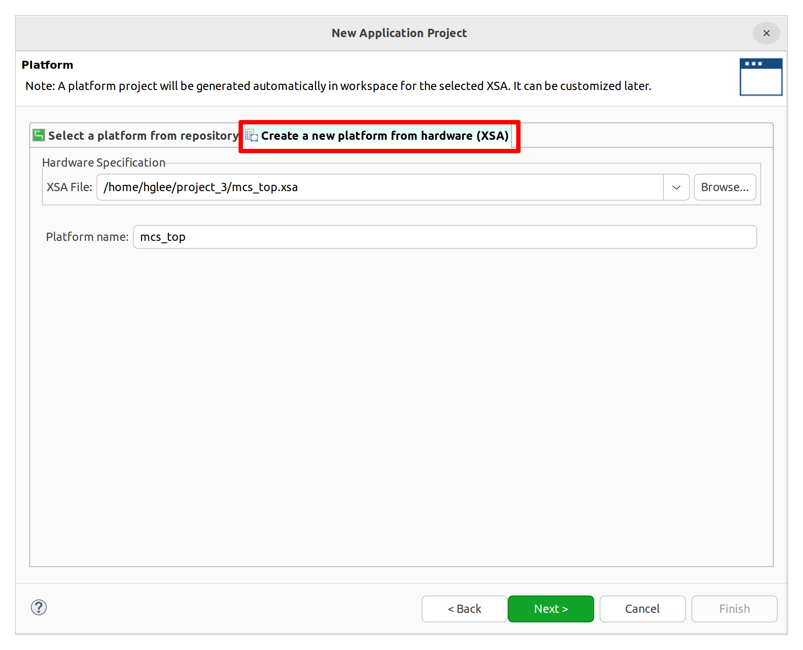
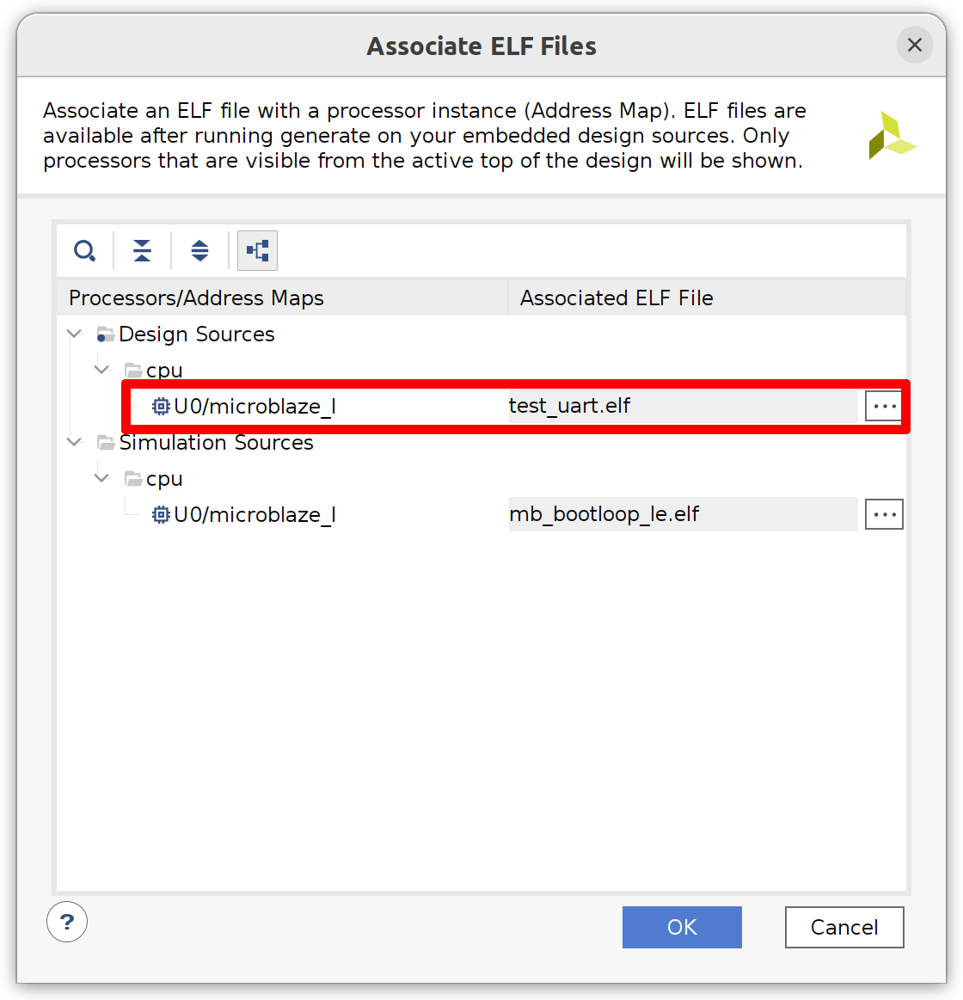

# UART

Send message to PC by USB UART.

## Target
### Software

* Xilinx Vivado 2023.1
* Xilinx Vitis 2023.1

### Hardware

* Alchitry Au Board : Xilinx Artix 7 FPGA

## Create Vivado Project and Build

0. Create project using script.

You can create project using init.sh script.

Edit install path (XILINX_VIVADO) in init.sh then run if you want.

You can skip step 1 ~ 5 if you created project by script.

If you want just UART tx without MCS, you can use source under `hdl_without_msc`. Then you can skip MCS related steps (IP, Vitis).

1. Create new RTL project in Vivado.

You need to select part 'xc7a35tftg256-1'.


2. Add Microblaze MCS IP

Select 'IP Catalog' under project, search and open 'Microblaze MCS'.


Option

- Component Name: cpu
- MCS Input Clock Frequency: 100 MHz
- MCS Memory Size: 128 KB
- MCS Enable IO BUS
- Others to default


3. Add constraint file to project.

Add alchitry.xdc in constraint directory to project.

4. Add source files to project.

Add hdl directory to project.

5. Set 'bin_file' option to implementation.

You need generate bin file to upload.

Right click on 'Implementation' and enable 'bin_file' in 'write_bitstream' section.


6. Generate Bitstream

7. Export hardware

Select 'Export Hardware' under 'File > Export' and select 'Include bitstream'.

## Create Vitis Project and Build

### Vitis 2023.1

0. Create project using script.

You can create project using init_vitis.sh script.

Edit install path (XILINX_VITIS) in init_vitis.sh then run if you want.

You can skip step 1 ~ 2 if you created project by script.

1. Create new Application project in Vitis.

Run 'Vitis', not 'Vitis HLS'. If you cannot find 'Vitis', you need to install it.

- In 'Create a new platform hardware(XSA)', select exported hardward previous step (mcs_top.xsa).
- Enter your application project name in next step.
- Set OS to 'standalone'
- Use 'Empty Application(C++) template'




2. Import source files to project.

Import all source files in sw directory to project.

3. Build elf file.

You can find generated elf file under application project folder.

## Generate Merged Bit File

1. Switch to Vivado and set generated elf file to bitstream.

Select project and open 'Tools > Associate ELF files' and set generated elf file to 'Design Sources > cpu'.




2. Generate bitstream again.

After generate, you can find 'mcs_top.bin' file under project folder.

## Upload

Same as [FtBasicWrite](../FtBasicWrite/README.md)

Ensure not unbind second USB device.

1. Prepare loader program

You need to use loader program to upload: https://github.com/alchitry/alchitry-loader.git

Clones repository and build loader program.

2. Connect USB

Connect USB cable to main Au board and unbind first USB device.

For example, you can see detected USB devices like this in Linux:

```
[ 4461.753982] ftdi_sio 3-3:1.0: FTDI USB Serial Device converter detected
[ 4461.754117] usb 3-3: Detected FT2232H
[ 4461.754428] usb 3-3: FTDI USB Serial Device converter now attached to ttyUSB0
[ 4461.756568] ftdi_sio 3-3:1.1: FTDI USB Serial Device converter detected
[ 4461.756630] usb 3-3: Detected FT2232H
[ 4461.756841] usb 3-3: FTDI USB Serial Device converter now attached to ttyUSB1
```

Then unbind first USB device like this:

```
echo '3-3:1.0' | sudo tee /sys/bus/usb/drivers/ftdi_sio/unbind
```

3. Upload bin file

You can upload to RAM like this:

```
sudo ./alchitry_loader -t au -r mcs_top.bin
```

You can see message after upload like this:

```
Found Alchitry Au as device 0.
Programming FPGA...
Done.
```

## Test

You can open USB UART by second USB device.

If you use minicom on Linux, run like this:

```
sudo minicom -b 9600 -D /dev/ttyUSB1
```

You can see messages by USB UART and led blinking.

If you edited application source in sw, you need to generate elf file then genrate bitstream again.
