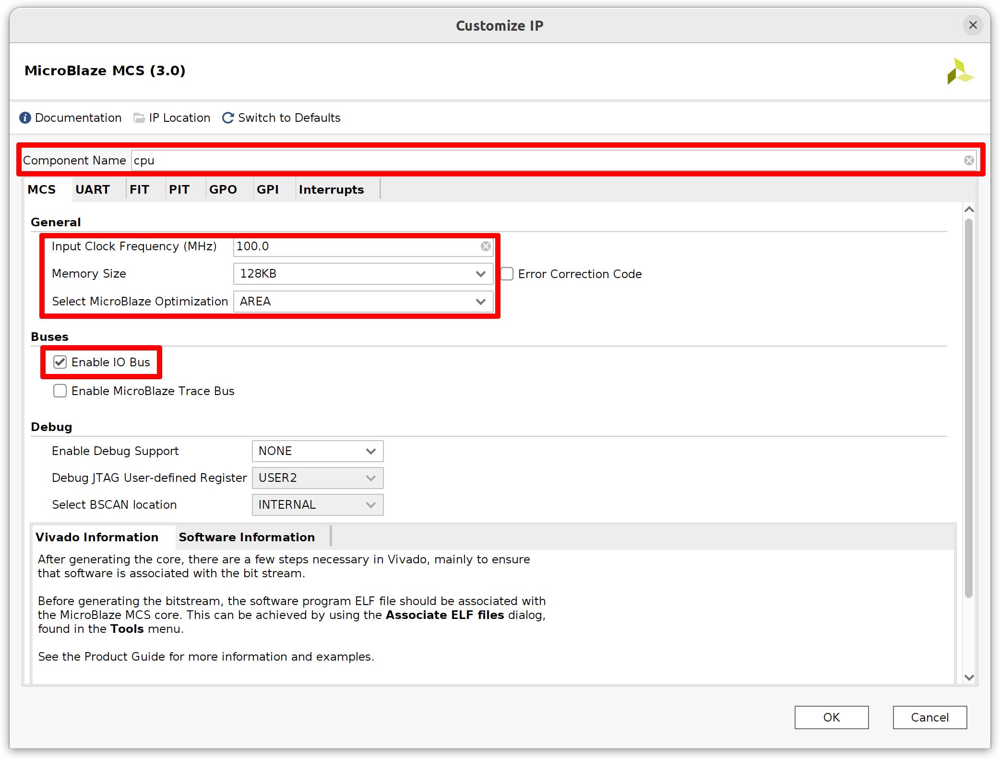
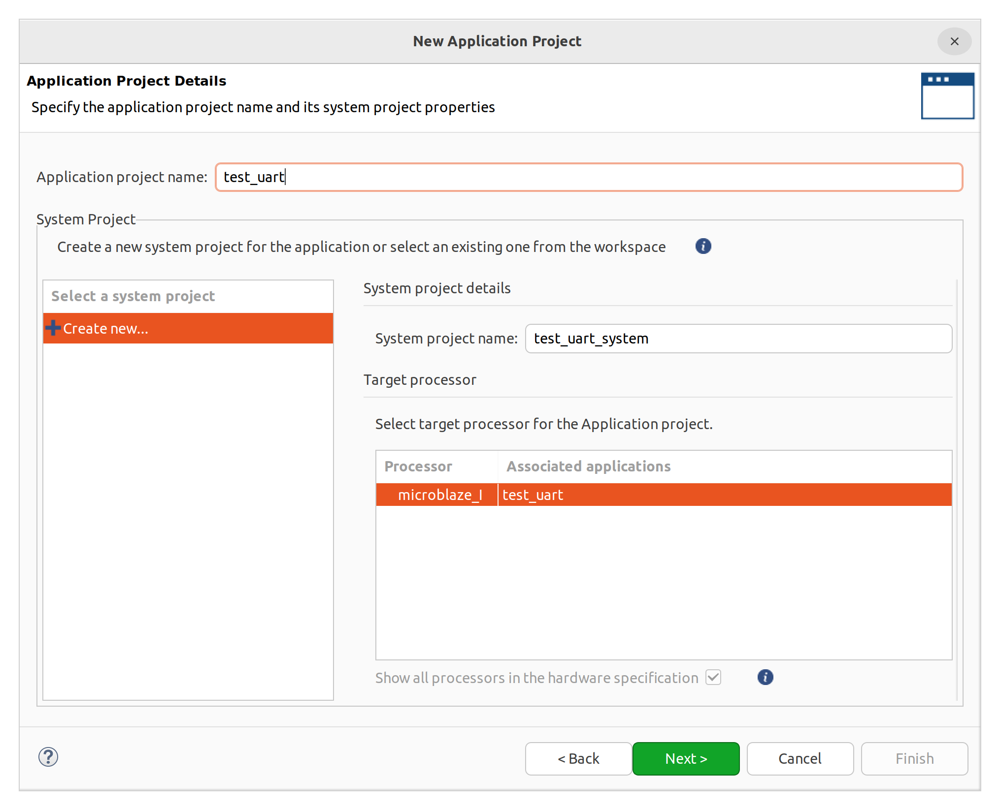
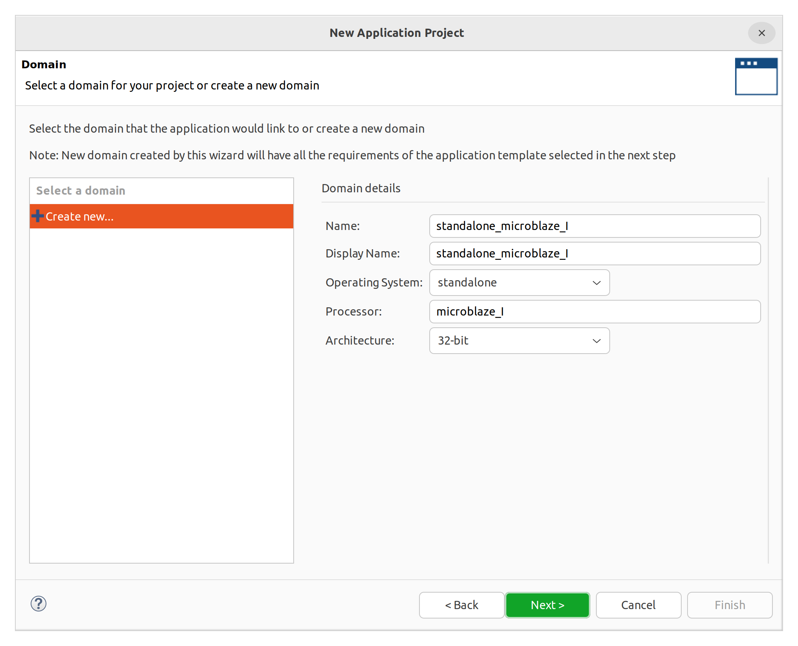

# UART

USB UART를 통하여 PC에 메시지를 전송하는 예제입니다.

## 대상
### 소프트웨어

* Xilinx Vivado 2023.1
* Xilinx Vitis 2023.1

### 하드웨어

* Alchitry Au Board : Xilinx Artix 7 FPGA

## Vivado 프로젝트 생성과 빌드

0. 스크립트로 프로젝트 생성하기

`init.sh` 스크립트를 실행하여 프로젝트를 생성할 수 있습니다.

필요한 경우 `init.sh` 스크립트 안에 설치 경로 (XILINX_VIVADO)를 수정하여 실행합니다.

스크립트로 프로젝트를 생성한 경우 1 ~ 5 단계 과정을 생략할 수 있습니다.

MCS 를 사용하지 않고 단순 UART tx만 사용하려는 경우 `hdl_without_msc` 하위의 소스를 사용할 수 있습니다. 이 경우 MCS 관련 된 단계 (IP, Vitis)를 생략할 수 있습니다.

1. Vivado에서 새 RTL 프로젝트 생성

프로젝트 생성 시 part를 `xc7a35tftg256-1` 로 선택합니다.


2. Microblaze MCS IP 추가

프로젝트 상의 `IP Catalog` 을 선택하고, `Microblaze MCS` 을 검색하여 엽니다.


옵션

- Component Name: **cpu**
- MCS Input Clock Frequency: 100 MHz
- MCS Memory Size: 128 KB
- MCS Enable IO BUS
- Others to default



3. 프로젝트에 constraint 파일 추가

`constraint` 디렉토리의 `alchitry.xdc` 파일을 프로젝트에 추가합니다.

4. 프로젝트에 소스 파일 추가

`hdl` 디렉토리의 모든 소스 파일을 프로젝트에 추가합니다.

5. implementation 의 `bin_file` 옵션 설정

업로드를 위해서 bin file 형태로 생성할 필요가 있습니다.

`Implementation` 에서 우클릭 후 `write_bitstream` 부분의 `bin_file` 을 활성화합니다.


6. 비트스트림 생성

7. hardware 내보내기

메뉴의 'File > Export' 에서 'Export Hardware' 을 선택하고 'Include bitstream' 를 선택하여 내보냅니다.

## Vitis 프로젝트 생성과 빌드

### Vitis 2023.1

0. 스크립트로 프로젝트 생성하기

`init_vitis.sh` 스크립트를 실행하여 프로젝트를 생성할 수 있습니다.

필요한 경우 `init_vitis.sh` 스크립트 안에 설치 경로 (XILINX_VITIS)를 수정하여 실행합니다.

스크립트로 프로젝트를 생성한 경우 1 ~ 2 단계 과정을 생략할 수 있습니다.

1. Vitis에서 새 Application project 생성

'Vitis HLS' 가 아닌 'Vitis'를 실행합니다. 만약 'Vitis' 를 찾을 수 없다면 설치가 필요합니다.

- 'Create a new platform hardware(XSA)' 단계에서 이전 단계에서 export 한 hardware를 선택합니다(mcs_top.xsa)
- 다음 단계에서 application project 이름을 입력합니다.
- OS를 `standalone` 선택합니다.
- `Empty Application(C++) template` 를 선택합니다.






2. 프로젝트에 소스 파일 import

`sw` 디렉토리의 모든 파일을 project에 import 합니다.

3. elf 파일 빌드

빌드 후 생성된 elf 파일을 application project 폴더에서 찾을 수 있습니다.

## Merge된 bit 파일 생성

1. Vivado로 전환 후 생성된 elf 파일을 bitstream에 선택합니다.

프로젝트를 선택하고, 메뉴 상의 `Tools > Associate ELF files` 을 선택한 후 `Design Sources > cpu` 부분에 생성된 elf 파일을 지정합니다.


2. bitstream 을 다시 생성

생성 후 프로젝트 디렉토리 하위에서 `mcs_top.bin` 을 찾을 수 있습니다.

## 업로드

[이전 방식](../FtBasicWrite/README.md) 을 참고합니다.

두번째 USB 장치를 unbind하지 않도록 주의합니다.

1. loader 프로그램 준비

업로드를 위해서 loader 프로그램이 필요합니다: https://github.com/alchitry/alchitry-loader.git

위의 저장소를 clone 후 loader 프로그램을 빌드합니다.

2. USB 연결

메인 Au 보드쪽에 USB 케이블을 연결하고 첫번째 USB 장치를 unbind 합니다.

예를 들면, Linux 상에서는 다음과 같이 USB 장치가 인식된 것을 확인할 수 있습니다:

```
[ 4461.753982] ftdi_sio 3-3:1.0: FTDI USB Serial Device converter detected
[ 4461.754117] usb 3-3: Detected FT2232H
[ 4461.754428] usb 3-3: FTDI USB Serial Device converter now attached to ttyUSB0
[ 4461.756568] ftdi_sio 3-3:1.1: FTDI USB Serial Device converter detected
[ 4461.756630] usb 3-3: Detected FT2232H
[ 4461.756841] usb 3-3: FTDI USB Serial Device converter now attached to ttyUSB1
```

위와 같은 경우 첫번째 USB 장치를 다음 명령과 같이 unbind 합니다:

```
echo '3-3:1.0' | sudo tee /sys/bus/usb/drivers/ftdi_sio/unbind
```

3. bin 파일 업로드

RAM 영역에 업로드하는 경우 다음과 같은 명령으로 업로드 할 수 있습니다:

```
sudo ./alchitry_loader -t au -r mcs_top.bin
```

정상적으로 업로드된 경우 다음과 같은 메시지를 확인할 수 있습니다:

```
Found Alchitry Au as device 0.
Programming FPGA...
Done.
```

## 테스트

두번째 USB 장치를 통하여 USB UART를 열 수 있습니다.

Linux 상에서 minicom을 사용하는 경우 다음과 같이 열 수 있습니다:

```
sudo minicom -b 9600 -D /dev/ttyUSB1
```

LED가 깜빡이는 것과 함께 USB UART를 통하여 메시지를 확인할 수 있습니다.

sw 의 application 소스를 수정한 경우, elf 파일을 생성한 수 bitstream 을 다시 생성하여 올릴 필요가 있습니다.
